# Проект по тестированию сайта "DemoQA"
> <a target="_blank" href="https://demoqa.com/">Demo QA</a>

### Особенности проекта

* Оповещения о тестовых прогонах в Telegram
* Отчеты с видео, скриншотом, логами браузера, DOM моделью страницы
* Сборка проекта в Jenkins
* Отчеты Allure Report
* Интеграция с Allure TestOps
* Автоматизация отчетности о тестовых прогонах в Jira
* Запуск автотестов в Selenoid

----

### Используемый стэк

           

----

### Локальный запуск автотестов

#### Выполнить в cli:
> [!NOTE]
> Ключ выбора версии `--browser-version` не обязателен
```bash
python -m venv .venv
source .venv/bin/activate
pip install -r requirements.txt
pytest . --browser-version=100
```

#### Получение отчёта:
```bash
allure serve build/allure-results
```

----

### Проект в Jenkins
> <a target="_blank" href="https://jenkins.autotests.cloud/job/C08-itpmkz-lesson-15/">Ссылка</a>

#### Параметры сборки
> [!NOTE]
> Параметры сборки не обязательны
```python
CONTEXT = ['local', 'stage', 'prod'] # Окружение
run_remote = true - для запуска в CI/CD
```
#### Запуск автотестов в Jenkins
1. Открыть <a target="_blank" href="https://jenkins.autotests.cloud/job/C08-itpmkz-lesson-15/">проект</a>

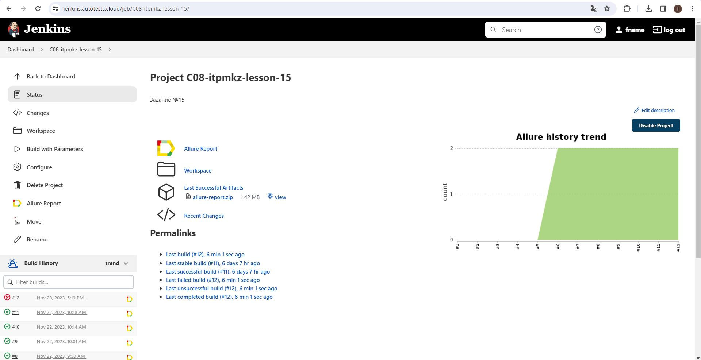

2. Нажать "Build with Parameters"
4. Из списка "CONTEXT" выбрать: PROD
5. Оставить run_remote = true
6. Нажать "Build"

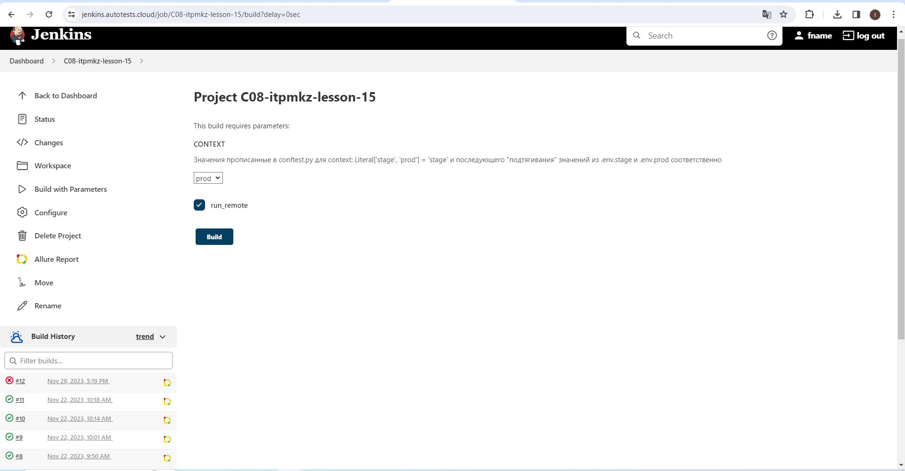

----

### Allure отчет
#### Общие результаты 
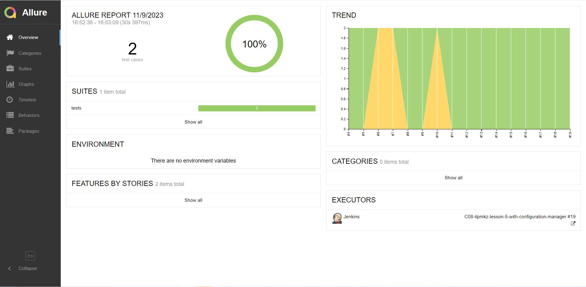

#### Результаты прохождения теста
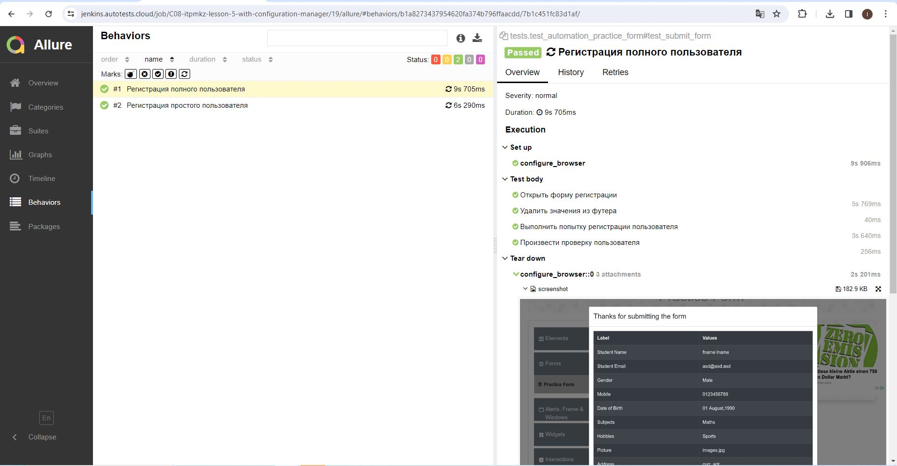

#### Графики

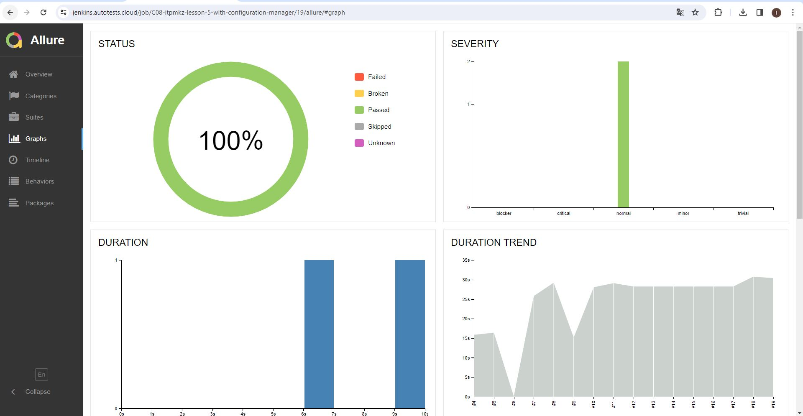
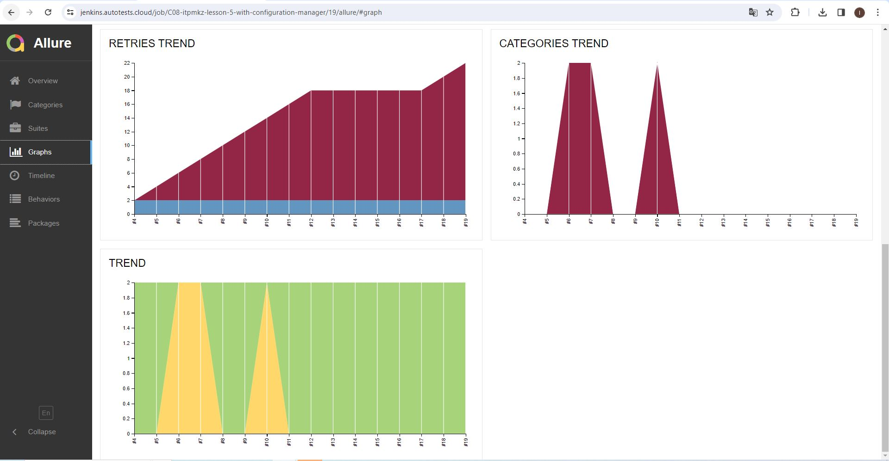

----

### Интеграция с Allure TestOps
> <a target="_blank" href="https://allure.autotests.cloud/project/3863/dashboards">Ссылка на проект</a>

#### Дашборд с общими показателями тестовых прогонов

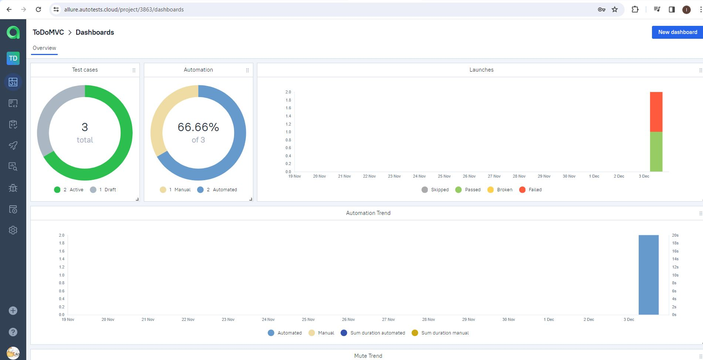

#### История запуска тестовых наборов

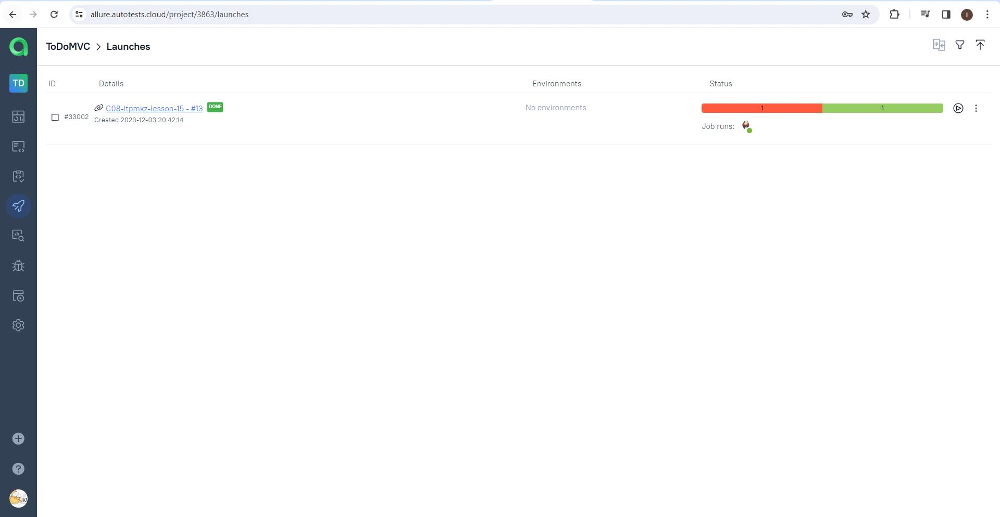

#### Тест кейсы

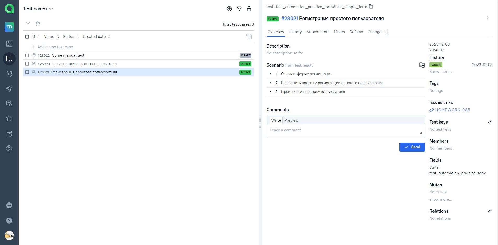

----

### Интеграция с Jira
> <a target="_blank" href="https://jira.autotests.cloud/browse/HOMEWORK-985">Ссылка на проект</a>

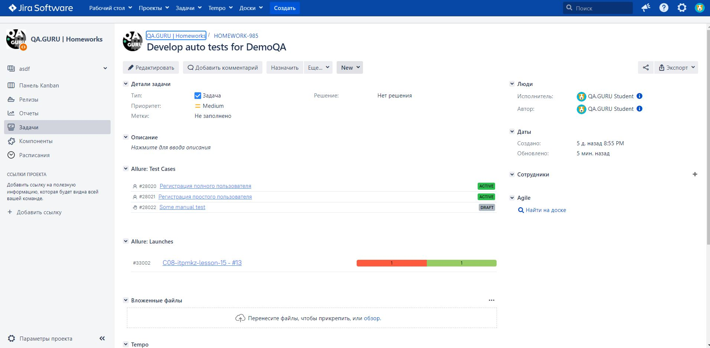

----

### Оповещения в Telegram
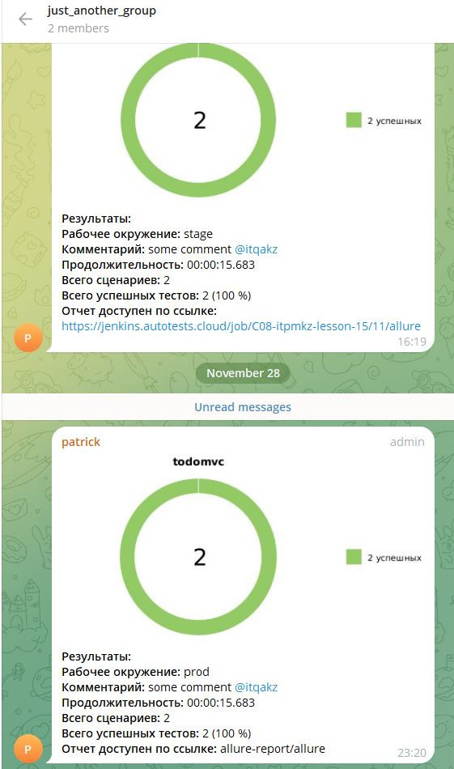

----

### Видео прохождения автотеста
https://github.com/ils-808/qaguru_lesson_5/assets/15216590/776b415e-80e2-4b75-b229-054c7b4e7894


----
